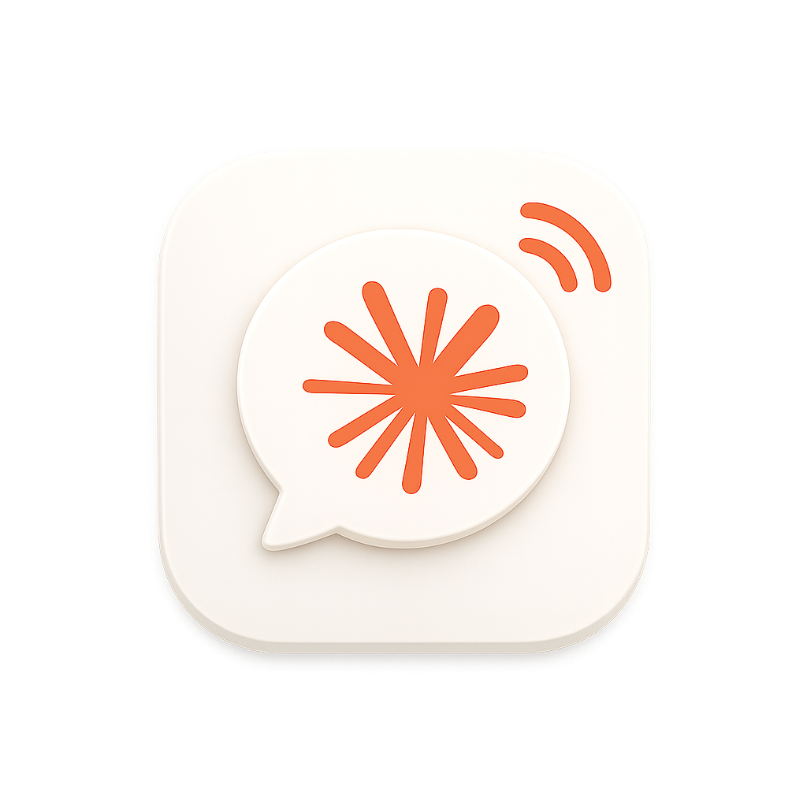
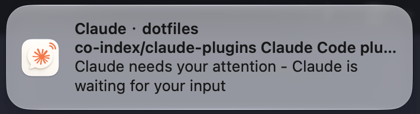

<div align="center">



# ccnotify

**Clickable macOS notifications from the command line.**

A tiny, modern replacement for `terminal-notifier`, built on
`UNUserNotificationCenter` — about 150 lines of Swift, no dependencies.

[English](#english) · [中文](#中文)

</div>

---

## English

### Why

[terminal-notifier](https://github.com/julienXX/terminal-notifier) pioneered
command-line notifications on macOS, but its latest release (2.0.0, from
2017) still builds on the deprecated `NSUserNotification` API, and the v3
rewrite is still brewing on a branch. ccnotify keeps its command-line
interface and its clever app-bundle architecture, reimplemented from scratch
on the modern `UNUserNotificationCenter` API — and shipping today.

The headline feature: **clicking a notification focuses the app you choose** —
pass `-activate` with a bundle id and the click jumps you back to your
terminal, editor, or anything else.



ccnotify is a general-purpose tool: despite the name, nothing in it is
specific to Claude Code. Use it from CI pipelines, cron jobs, build scripts,
git hooks — anything that can run a shell command.

### Install

```sh
brew install co-index/tap/ccnotify
```

Or from source (requires the Xcode Command Line Tools):

```sh
git clone https://github.com/co-index/ccnotify.git
cd ccnotify
sudo make install            # PREFIX=/usr/local by default
```

The first notification triggers a macOS permission prompt; allow **ccnotify**
under System Settings → Notifications if banners do not appear.

### Usage

```sh
ccnotify -message "Build finished"
ccnotify -title "CI" -subtitle "main" -message "All tests passed" -sound Glass
ccnotify -message "Click me" -activate com.microsoft.VSCode
ccnotify -message "Deploy done" -image ./logo.png -sound default
```

| Flag        | Meaning                                                        |
| ----------- | -------------------------------------------------------------- |
| `-message`  | Notification body (required)                                   |
| `-title`    | Notification title (default: `ccnotify`)                       |
| `-subtitle` | Notification subtitle                                          |
| `-sound`    | `default`, a sound from `/System/Library/Sounds` (e.g. `Glass`, `Ping`), or a custom sound (see below) |
| `-image`    | Image (png/jpg/gif) attached to the banner, shown as a thumbnail on its right |
| `-activate` | Bundle id of the app to focus when the notification is clicked |
| `-version`  | Print the version                                              |
| `-help`     | Show help                                                      |

Find an app's bundle id with:

```sh
osascript -e 'id of app "Visual Studio Code"'
```

### Banner image and custom sound

- **Banner image**: `-image path/to.png` attaches an image to the
  notification. It appears as a small thumbnail on the right side of the
  banner (click or long-press the notification to see it full size) — handy
  for giving each project or pipeline its own visual identity. Note that the
  app icon on the **left** of the banner cannot be changed per notification;
  macOS always draws the posting app's own icon there. To change that one,
  rebuild the app with your own `assets/ccnotify.icns`.
- **Custom sound**: drop an `.aiff` file into `~/Library/Sounds` and pass its
  name without the extension, e.g. `-sound MySound`. `-sound default` plays
  the system default notification sound.

### Changing the app icon

The left icon belongs to the app bundle, so changing it means building from
source with your own icon:

```sh
git clone https://github.com/co-index/ccnotify.git
cd ccnotify

# Turn a 1024x1024 PNG (with transparency) into the icns:
mkdir ccnotify.iconset
for s in 16 32 128 256 512; do
  sips -z $s $s my-icon.png --out ccnotify.iconset/icon_${s}x${s}.png
  sips -z $((s*2)) $((s*2)) my-icon.png --out ccnotify.iconset/icon_${s}x${s}@2x.png
done
iconutil -c icns ccnotify.iconset -o assets/ccnotify.icns

sudo make install        # replaces the brew-installed shim if /usr/local/bin comes first
```

If macOS keeps showing the old icon (LaunchServices caches it), re-register
the app and restart Notification Center:

```sh
/System/Library/Frameworks/CoreServices.framework/Versions/A/Frameworks/LaunchServices.framework/Versions/A/Support/lsregister -f /usr/local/libexec/ccnotify.app
killall NotificationCenter
```

### Use with Claude Code

ccnotify was born as the notifier behind a Claude Code hook setup: get a
banner when Claude finishes a task or needs your attention, click it, and
land back in the exact app that was running Claude Code. The ready-made
hook ships as a Claude Code plugin — see
[co-index/claude-plugins](https://github.com/co-index/claude-plugins).

### How it works

`ccnotify` is a shim that executes the binary inside `ccnotify.app`. Posting
runs the app for a fraction of a second; when you later click the
notification, macOS relaunches the app in the background, which reads the
target bundle id from the notification payload and activates that app. The
same architecture terminal-notifier uses — which is why a plain CLI binary
cannot do this, and an app bundle can.

Because the formula builds from source on your machine, no Apple Developer
certificate or notarization is involved; the app is ad-hoc signed locally.

### Troubleshooting

- No banner at all: allow "ccnotify" under System Settings → Notifications
  (the first post triggers the permission prompt).
- Clicking does nothing (no app gets focused): upgrade to v1.1.1+. Older
  versions could leave LaunchServices pointing at a deleted app path after
  a brew upgrade; since v1.1.1 every post re-registers the live bundle, so
  posting one notification heals the registration.

### License

[MIT](LICENSE). Not affiliated with Apple or with
[terminal-notifier](https://github.com/julienXX/terminal-notifier), whose
interface design this project gratefully follows.

---

## 中文

### 为什么做这个

[terminal-notifier](https://github.com/julienXX/terminal-notifier) 开创了
macOS 命令行通知，但它已发布的最新版本（2017 年的 2.0.0）仍基于早已废弃
的 `NSUserNotification` API，v3 重写还在分支上进行、尚未发版。ccnotify
保留了它的命令行接口和 app 壳架构，用现代的 `UNUserNotificationCenter`
API 从零重新实现并已可用，约 150 行 Swift，零依赖。

核心特性：**点击通知可以聚焦你指定的应用**——通过 `-activate` 传入
bundle id，点击横幅即可跳回你的终端、编辑器或任何应用。


ccnotify 是通用工具：虽然名字带 cc，但内部没有任何与 Claude Code 耦合
的逻辑。CI 流水线、cron 任务、构建脚本、git hook——任何能执行 shell
命令的地方都能用它。

### 安装

```sh
brew install co-index/tap/ccnotify
```

或从源码安装（需要 Xcode Command Line Tools）：

```sh
git clone https://github.com/co-index/ccnotify.git
cd ccnotify
sudo make install            # 默认 PREFIX=/usr/local
```

首次发送通知会弹出系统授权提示；如果看不到横幅，请在
系统设置 → 通知 中允许 **ccnotify**。

### 用法

```sh
ccnotify -message "构建完成"
ccnotify -title "CI" -subtitle "main" -message "测试全部通过" -sound Glass
ccnotify -message "点我跳回 VS Code" -activate com.microsoft.VSCode
ccnotify -message "部署完成" -image ./logo.png -sound default
```

参数含义见上方英文表格。查询应用 bundle id：

```sh
osascript -e 'id of app "Visual Studio Code"'
```

### 横幅附图与自定义声音

- **横幅附图**：`-image path/to.png` 把图片附加到通知上，以**右侧小
  缩略图**的形式显示（点开或长按通知可看大图），适合给不同项目或流水
  线配不同的视觉标识。注意横幅**左侧**的 app 图标无法按条替换——
  macOS 固定显示发通知的 app 自身图标；想换它需要用自己的
  `assets/ccnotify.icns` 重新构建。
- **自定义声音**：把 `.aiff` 文件放进 `~/Library/Sounds`，然后传不带
  扩展名的文件名，如 `-sound MySound`；`-sound default` 播放系统默认
  通知音。

### 更换左侧 app 图标

左侧图标属于 app 包本身，更换它需要用自己的图标从源码构建：

```sh
git clone https://github.com/co-index/ccnotify.git
cd ccnotify

# 把一张 1024x1024 的透明背景 PNG 转成 icns：
mkdir ccnotify.iconset
for s in 16 32 128 256 512; do
  sips -z $s $s my-icon.png --out ccnotify.iconset/icon_${s}x${s}.png
  sips -z $((s*2)) $((s*2)) my-icon.png --out ccnotify.iconset/icon_${s}x${s}@2x.png
done
iconutil -c icns ccnotify.iconset -o assets/ccnotify.icns

sudo make install        # 若 /usr/local/bin 在 PATH 更前面，会盖过 brew 安装的版本
```

如果 macOS 仍显示旧图标（LaunchServices 有缓存），重新注册 app 并重启
通知中心：

```sh
/System/Library/Frameworks/CoreServices.framework/Versions/A/Frameworks/LaunchServices.framework/Versions/A/Support/lsregister -f /usr/local/libexec/ccnotify.app
killall NotificationCenter
```

### 搭配 Claude Code

ccnotify 最初就是为 Claude Code 的通知 hook 而生：Claude 完成任务或需要
你时弹出横幅，点击即可跳回运行 Claude Code 的那个应用。现成的 hook 已
打包为 Claude Code 插件，见
[co-index/claude-plugins](https://github.com/co-index/claude-plugins)。

### 工作原理

`ccnotify` 命令是一个薄壳，实际执行 `ccnotify.app` 里的二进制。发送通知
时 app 只运行零点几秒；之后你点击通知，macOS 会在后台重新拉起这个 app，
它从通知负载中读取目标 bundle id 并激活对应应用。这正是 terminal-notifier
的架构——纯 CLI 二进制做不到这件事，app 壳可以。

brew formula 在你本机从源码编译，因此不涉及 Apple 开发者证书或公证，
应用使用本地 ad-hoc 签名。

### 排障

- 完全没有横幅：在系统设置 → 通知里允许 "ccnotify"（首次发送会触发授权
  弹窗）。
- 点击没反应（没有应用被聚焦）：升级到 v1.1.1+。旧版本在 brew 升级后,
  LaunchServices 可能仍指向已删除的旧 app 路径；v1.1.1 起每次发送都会
  重新注册当前 bundle，发一条通知即可自愈。

### 许可

[MIT](LICENSE)。本项目与 Apple、
[terminal-notifier](https://github.com/julienXX/terminal-notifier) 均无关联，
并诚挚感谢后者的接口设计。
